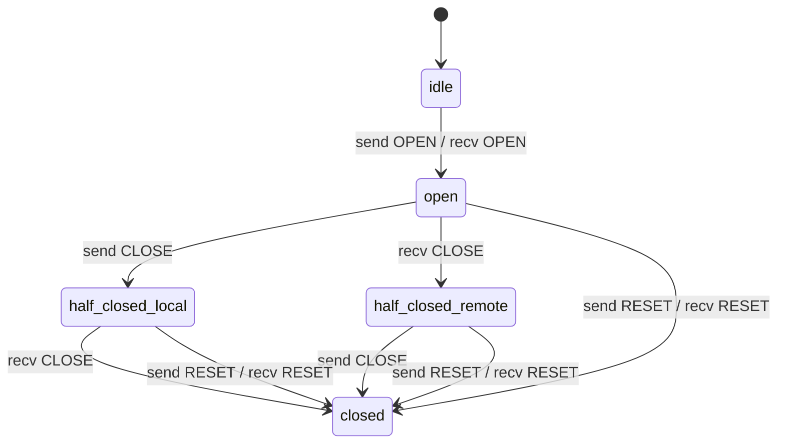
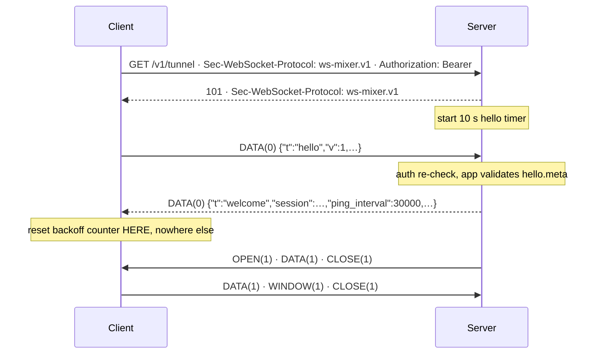
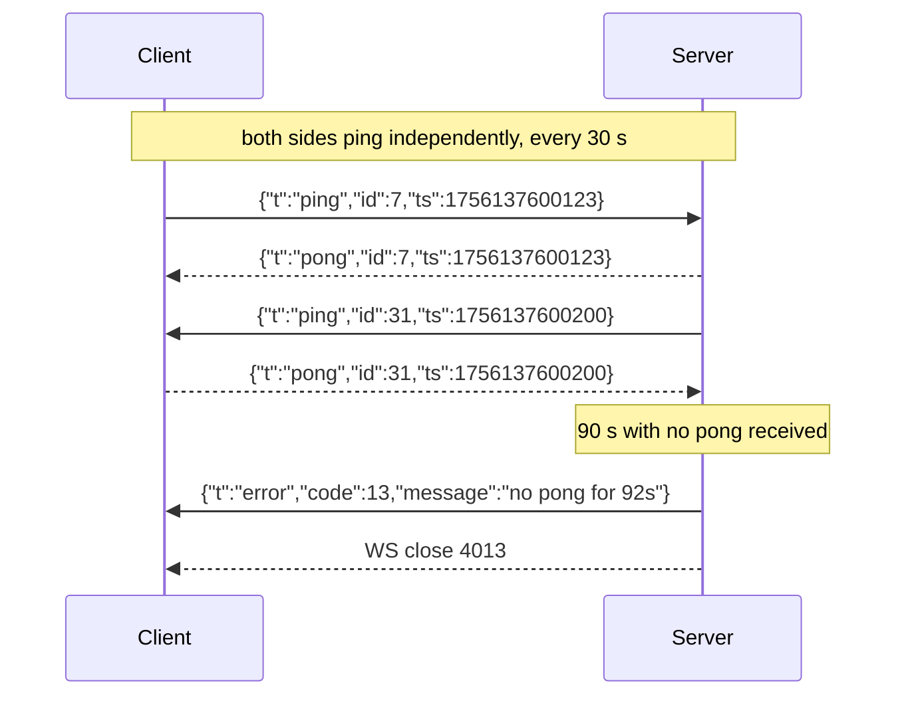
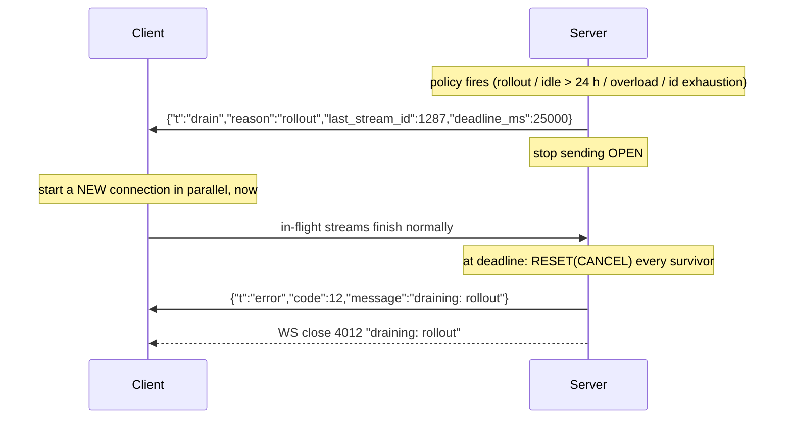

# ws-mixer.v1 wire spec

Status: **normative**. This is the wire specification for the `ws-mixer.v1` WebSocket subprotocol —
framing, streams, flow control, the control channel, error codes, and the connection lifecycle. Any
implementation (Go, JS, Python, or otherwise) that speaks `ws-mixer.v1` MUST conform to this document.

Section numbering is unchanged from the original combined design document
(`docs/OVERVIEW.md` in this repo's history) so existing cross-references — fixtures, the conformance
runner, and other repos' docs — keep citing e.g. "§2.7" or "§2.9" without renumbering.

Research inputs (evidence, prior art and rejected alternatives live there, not here):

- [pass 1 — framing and encoding](./research/2026-08-25-framing-and-encoding.md)
- [pass 2 — flow control and stream lifecycle](./research/2026-08-25-flow-control-and-stream-lifecycle.md)
- [pass 3 — control channel and connection lifecycle](./research/2026-08-26-control-channel-and-connection-lifecycle.md)

Inline `decision N` labels are this document's own informal numbering from the original design
document and are independent of the dated, stably-numbered protocol decision log in
[`DECISIONS.md`](./DECISIONS.md).

---

## 2. Wire spec (`ws-mixer.v1`)

This section is self-contained. An implementer should not need to open a research doc.

### 2.1 WebSocket handshake

```http
GET /v1/tunnel HTTP/1.1
Host: edge.mcpwarp.io
Upgrade: websocket
Connection: Upgrade
Sec-WebSocket-Version: 13
Sec-WebSocket-Protocol: ws-mixer.v1
Authorization: Bearer <token>
User-Agent: ws-mixer-py/0.2.0 (python/3.12 linux)
```

| Rule | Detail |
|---|---|
| Subprotocol | Client MUST offer `ws-mixer.v1`. Server MUST echo exactly one offered token. **If the 101 response omits the header, the client MUST fail and NOT retry** — it means a proxy or the wrong endpoint answered. |
| No overlap | Server fails the upgrade with **HTTP 400** + JSON body. Never 101-then-close. |
| Auth | `Authorization: Bearer <token>` is required, and `hello.token` MUST be present and equal to it. Bad/absent → **HTTP 401**, no 101. |
| Forbidden | Token in `Sec-WebSocket-Protocol` (collides with version negotiation, gets echoed back). Token in the query string (lands in every access log). |
| Opcode | **Binary (0x2) always.** A text frame is a connection `PROTOCOL_ERROR`. |
| Compression | `permessage-deflate` MUST be disabled on both ends. |
| Message = frame | **One WebSocket message carries exactly one mux frame.** No length field; payload length is `len(message) - 8`. |
| Version | Pinned by the subprotocol string, confirmed by `hello.v` / `welcome.v`. No per-frame version byte. |

### 2.2 Frame header

Fixed 8 bytes, big-endian. `struct.unpack('>BBHI', hdr)` / `DataView.getUint32(4)` / `binary.BigEndian.Uint32(b[4:8])`.

| Offset | Size | Field | Rule |
|---|---|---|---|
| 0 | 1 | `type` | `0x00` OPEN · `0x01` DATA · `0x02` WINDOW · `0x03` CLOSE · `0x04` RESET |
| 1 | 1 | `flags` | No flags in v1. Senders MUST write `0`. Receivers MUST ignore unknown bits. |
| 2 | 2 | `reserved` | MUST be `0` on send. Receivers MUST ignore (not reject — that would make them unusable later). |
| 4 | 4 | `stream_id` | uint32 BE. High bit MUST be `0`. `0` = control channel. |
| 8 | … | `payload` | `len(ws_message) - 8` |

Unknown `type` → **ignore and count**. Combined with `capabilities` negotiation (§2.7) a peer never sends a type the other side did not advertise, so this is belt-and-braces.

### 2.3 Frame payloads

| Type | Payload | Notes |
|---|---|---|
| `OPEN` | **empty** | Pure state event. No metadata, no ACK to wait for. A DATA frame may follow in the same tick. |
| `DATA` | opaque bytes | On stream 0: exactly one UTF-8 JSON **object** (§2.6). |
| `WINDOW` | `uint32 BE increment`, exactly 4 bytes | Legal range `1 … 2^31-1`. Length ≠ 4 → conn `FRAME_SIZE_ERROR`. Increment 0 → stream `PROTOCOL_ERROR`. |
| `CLOSE` | **empty** | Trailing bytes MUST be ignored and counted. |
| `RESET` | `uint32 BE error_code` + optional UTF-8 message | Message SHOULD be ≤ 256 B, no NUL. `< 4 bytes` → conn `FRAME_SIZE_ERROR`. Invalid UTF-8 in the message → replace chars, do not kill the connection. |

### 2.4 Limits

| Limit | Value | On violation |
|---|---|---|
| Max WS message | **65 544 B** (8 header + 65 536 payload) | conn `FRAME_SIZE_ERROR`, WS close 4004 (or 1009 if the WS library rejected it first) |
| Recommended DATA chunk | **16 KiB (16 384 B)** | — (sender-side default, not enforced) |
| Stream-0 payload | **≤ 16 KiB** | conn `ENHANCE_YOUR_CALM` |
| Initial window (default) | **262 144 B (256 KiB)** per direction, per stream | tunable per deploy, advertised in `hello`/`welcome` |
| `max_streams` (default) | **64** | tunable per deploy; server's `welcome` value is authoritative |
| WS close reason | ≤ **123 bytes UTF-8**, truncated on a character boundary | — |

64 KiB is a cap, not a target. 16 KiB is HTTP/2's `SETTINGS_MAX_FRAME_SIZE` default and bounds head-of-line
blocking: on a 1 Mbps home uplink a 64 KiB frame injects ~500 ms of latency into every other stream.
64 KiB also fits under Python `websockets`' 1 MiB `max_size` default, so a Python implementer who never
touches it still interoperates.

### 2.5 Streams

- **31-bit ids.** High bit reserved, MUST be 0.
- **Stream 0 = control.** Never opened, never closed, never flow-controlled.
- **Only the server opens streams.** Server-opened ids are **odd** (1, 3, 5, …). Even ids are permanently
  reserved so client-initiated streams can be added later without a v2.
- **Strictly increasing, never reused.** One counter, `highest_opened`, is all the state needed.
- **Exhaustion** (2^30 odd ids ≈ 12 days at 1000 streams/s): server sends `drain{reason:"id_exhausted"}`
  and closes. **No wrap-around** — wrapping is where the reuse bug lives.

#### State machine



**Sending** (`—` = MUST NOT send):

| State | OPEN | DATA | WINDOW | CLOSE | RESET |
|---|:--:|:--:|:--:|:--:|:--:|
| idle | ✔ (server only) | — | — | — | — |
| open | — | ✔ | ✔ | ✔ | ✔ |
| half-closed (local) | — | — | ✔ | — | ✔ |
| half-closed (remote) | — | ✔ | — ¹ | ✔ | ✔ |
| closed | — | — | — | — | — ² |

¹ pointless but harmless; an already-in-flight WINDOW is legal on the receive side.
² never send RESET in answer to RESET (loop prevention).

**Receiving:**

| State | recv OPEN | recv DATA | recv WINDOW | recv CLOSE | recv RESET |
|---|---|---|---|---|---|
| `id > highest_opened` (never opened) | → open | **conn PROTOCOL_ERROR** | **conn PROTOCOL_ERROR** | **conn PROTOCOL_ERROR** | **conn PROTOCOL_ERROR** |
| open | **conn PROTOCOL_ERROR** (dup) | buffer, debit credit | credit sender | → half-closed(remote) | → closed, drop buffer |
| half-closed (local) | conn PROTOCOL_ERROR | buffer, debit credit | **tolerate, ignore** | → closed | → closed, drop buffer |
| half-closed (remote) | conn PROTOCOL_ERROR | **RESET(STREAM_CLOSED)** | **tolerate, ignore** | **RESET(STREAM_CLOSED)** | → closed |
| `id ≤ highest_opened`, no live stream | conn PROTOCOL_ERROR | **discard + count + debug log** | discard + count | discard + count | discard + count |

**Decision 3, restated because it is the one asymmetry people get wrong:**
a frame for a stream that *was* open and is now gone is a benign race (the peer's frames were already in
flight) → **discard, increment `wsmixer_stale_frames_total`, log at debug**. A frame for an id that was
**never** opened cannot be produced by any race → **connection error**.

**WINDOW must be tolerated late.** A peer may emit WINDOW just before it receives our CLOSE/RESET.
Receiving WINDOW on a half-closed or recently-closed stream is never an error. This is the one race the
ordered transport does not remove.

#### Half-close

- `CLOSE` means **"I will send no more DATA on this stream."** Direction-scoped. The peer may keep sending for hours.
- **CLOSE preserves buffered data; RESET discards it.** A receiver holding 40 KiB that then reads CLOSE MUST
  deliver those 40 KiB and *then* EOF. On RESET it drops them. This sentence is the most commonly botched
  part of a muxer — implement it literally.
- **Fully closed** = CLOSE sent *and* received, or RESET sent/received either way. Both ends then free the
  buffer, drop the table entry, stop tracking credit, and **retire the id forever**.
- **No stream-level timers.** An SSE response is legitimately half-closed for hours. Per-request deadlines
  belong to the application and are expressed as `RESET(CANCEL)`.

#### Request/response, end to end

| Step | Server (opener) | Client | Server state | Client state |
|---|---|---|---|---|
| 1 | `OPEN(id=n)` | | open | open |
| 2 | `DATA` × k (request, 16 KiB chunks) | credits with `WINDOW` as it consumes | open | open |
| 3 | `CLOSE` — request complete | reads EOF | half-closed(local) | half-closed(remote) |
| 4 | credits with `WINDOW` | `DATA` × m — response, possibly for hours | half-closed(local) | half-closed(remote) |
| 5 | | `CLOSE` — response complete | **closed** | **closed** |

### 2.6 Flow control

Per-stream credit window only. **No connection-level window** — the bound comes for free from
`max_streams × window`.

| Rule | Value |
|---|---|
| Scope | DATA payload bytes on streams ≥ 1 only. Headers, OPEN/CLOSE/RESET/WINDOW and all of stream 0 are **not** flow-controlled. |
| Initial window | Each peer announces its **own receive** window in `hello`/`welcome`. Default 256 KiB. **Fixed for the life of the connection** — there is no resize. |
| Sender at window 0 | MUST NOT send DATA. MAY send WINDOW/CLOSE/RESET. Blocks **in the application**, never on the socket read loop, never on other streams. |
| Receiver credits on **consumption** | Not on receipt. Crediting on receipt turns the window into an unbounded buffer and deletes the point. |
| WINDOW threshold | Send `WINDOW(unacked)` once `unacked ≥ window / 2`. ~2 WINDOW frames per window of data; never dribble small increments. |

```
per stream, receiver side:
  recv_window   credit still owed to the peer
  unacked       bytes delivered to the app, not yet credited

on DATA(n):     if n > recv_window:  CONNECTION ERROR FLOW_CONTROL_ERROR
                recv_window -= n ; buffer n
on app read(n): unacked += n
                if unacked >= window/2:
                    send WINDOW(unacked) ; recv_window += unacked ; unacked = 0
```

**Decision 1 — violations are connection-fatal.** DATA exceeding remaining credit, or a WINDOW that would
push the send window past `2^31-1`, kills the connection with `FLOW_CONTROL_ERROR` (close 4003). Not a
stream reset. The receiver has already read the bytes off the wire; a stream-scoped reset would leave the
two credit counters permanently out of sync, and a partially-desynchronised connection is worse to debug
than a dead one. yamux does exactly this.

**Three rules that keep the transport healthy** (these are implementation obligations, not wire format):

1. **The read loop never blocks on application delivery.** Read message → parse header → append to the
   stream buffer (guaranteed to fit; credit says so) → loop. Otherwise one slow handler stalls the tunnel.
2. **Gate the write loop on the socket send buffer.** Credit bounds per-stream bytes; 64 streams × 256 KiB
   can still queue 16 MB into the WS library. Node: pause while `bufferedAmount > 1 MiB`. Python/Go: `await`/blocking `Write` gives it for free.
3. **Control frames jump the queue.** One writer task, two queues: drain control (WINDOW, CLOSE, RESET,
   stream-0 JSON) first, then **one ≤16 KiB DATA chunk per ready stream, round-robin**. Without round-robin
   one large tool result starves every SSE stream behind it.

### 2.7 Control channel (stream 0)

One JSON **object** per stream-0 DATA frame. UTF-8, no BOM. `t` is the discriminator and SHOULD be written
first (readers must not depend on order; it makes `tcpdump` legible). Never an array, never a bare scalar,
never two objects in one frame.

**Seven message types in v1.**

| `t` | Direction | When | Required | Optional |
|---|---|---|---|---|
| `hello` | C→S | first frame, always | `t`, `v`, `token`, `agent` | `window`, `max_streams`, `capabilities`, `meta` |
| `welcome` | S→C | reply to `hello` | `t`, `v`, `session`, `window`, `max_streams`, `ping_interval`, `ping_timeout` | `server`, `capabilities`, `meta` |
| `ping` | both | every `ping_interval` | `t`, `id` | `ts` |
| `pong` | both | immediately on `ping` | `t`, `id` | `ts` |
| `drain` | S→C (and C→S with `client_requested`) | rollout, id exhaustion, idle evict, any policy | `t`, `reason`, `last_stream_id` | `deadline_ms`, `retry_after_ms`, `message` |
| `error` | both | connection-fatal; last frame before close | `t`, `code`, `message` | `stream_id`, `last_stream_id` |
| **`app`** | **both** | **any time after `welcome`** | **`t`, `body`** | — |

```json
{"t":"hello","v":1,"token":"eyJhbGciOi…","agent":{"sdk":"ws-mixer-js","sdk_version":"0.3.1","runtime":"node/22.4.0","os":"darwin/arm64"},"window":262144,"max_streams":64,"capabilities":[]}
{"t":"welcome","v":1,"session":"01J8Z2K9QF3M4N5P6R7S8T9V0W","window":262144,"max_streams":64,"ping_interval":30000,"ping_timeout":90000,"server":{"name":"mcpwarp-edge","version":"1.4.2","node":"edge-7c9f-bkl2p"}}
{"t":"ping","id":42,"ts":1756137600123}
{"t":"pong","id":42,"ts":1756137600123}
{"t":"drain","reason":"rollout","last_stream_id":1287,"deadline_ms":25000,"message":"edge-7c9f-bkl2p is shutting down; reconnect now"}
{"t":"error","code":3,"message":"stream 41: received 20480 DATA bytes with 8192 credit remaining","stream_id":41,"last_stream_id":1287}
{"t":"app","body":{"mcpwarp":{"v":1,"op":"register","services":[{"id":"anki","name":"Anki MCP"}]}}}
```

#### Field tables

**`hello`** (client → server)

| Field | Type | Req | Notes |
|---|---|:--:|---|
| `t` | `"hello"` | ✔ | |
| `v` | integer | ✔ | must be `1` and match the subprotocol. Mismatch → `UNSUPPORTED` (4010) |
| `token` | string 1–4096 | ✔ | must equal the `Authorization` bearer token |
| `agent` | object | ✔ | `{sdk, sdk_version, runtime?, os?}`; strings ≤ 128 chars. **Required on purpose** — when a third-party SDK misbehaves the server log must name it |
| `window` | integer | | this peer's receive window, `16384 … 2^31-1`. Default 262144 |
| `max_streams` | integer | | streams this peer will accept, `1 … 100000`. Default 64 |
| `capabilities` | string[] | | `^[a-z0-9_.-]{1,64}$`. Absent = none |
| `meta` | object | | **opaque to ws-mixer**, delivered to the application before `welcome` is sent |

**`welcome`** (server → client)

| Field | Type | Req | Notes |
|---|---|:--:|---|
| `v` | integer | ✔ | version accepted. If the client does not support this `v` (or otherwise finds `welcome` unsupported), mismatch → client closes with `UNSUPPORTED` (4010) |
| `session` | string ≤ 64 | ✔ | connection id, ULID recommended. In every log line on both sides |
| `window` | integer | ✔ | the server's own receive window |
| `max_streams` | integer | ✔ | the **effective** cap = `min(client ask, server policy)`. Client MUST use this, and MAY lower it further to its own ceiling |
| `ping_interval` | integer ms | ✔ | server dictates, client obeys. Server MUST NOT set < 5000; client rejects smaller with `PROTOCOL_ERROR` |
| `ping_timeout` | integer ms | ✔ | MUST be ≥ 2 × `ping_interval`, else client → `PROTOCOL_ERROR` |
| `server` | object | | `{name, version, node}` — the mirror of `agent`, for the client's logs |
| `capabilities` | string[] | | as in `hello` |
| `meta` | object | | opaque; the application's answer to `hello.meta` |

**`ping` / `pong`**

| Field | Type | Req | Notes |
|---|---|:--:|---|
| `id` | integer `0 … 2^53-1` | ✔ | monotonic **per sender**; two independent sequences |
| `ts` | integer ms | | sender's clock; echoed **verbatim** in the `pong` |

A `pong` MUST carry the same `id` and `ts` and jump ahead of queued DATA. RTT = `now - ts` on the pinger's
own clock, so no table and no clock-skew problem. A `pong` for an id never sent → conn `PROTOCOL_ERROR`;
a duplicate `pong` → ignore + count. `pong` is never unsolicited.

**`drain`**

| Field | Type | Req | Notes |
|---|---|:--:|---|
| `reason` | enum string | ✔ | `rollout` \| `overload` \| `id_exhausted` \| `replaced` \| `maintenance` \| `client_requested` |
| `last_stream_id` | integer | ✔ | highest id the server has opened or will open. Everything above was definitely never processed |
| `deadline_ms` | integer | | grace for in-flight streams. Absent = immediately |
| `retry_after_ms` | integer | | reconnect hint. Absent = reconnect immediately with jitter |
| `message` | string ≤ 256 | | human text for the peer's log |

After sending `drain` the server MUST NOT send `OPEN`; it MAY keep sending DATA/WINDOW/CLOSE/RESET.
A client receiving `OPEN` with `id` > `last_stream_id` after `drain` MUST treat it as connection
`PROTOCOL_ERROR` (4001) — strict, not a stream-scoped `REFUSED_STREAM`, because it means the server has
violated the boundary it already promised.
An **unknown `reason` is not fatal** — treat as `maintenance` and count. (Closed enums degrade; unknown
*message types* do not — see below.) The client may send `drain` only with `reason:"client_requested"`.

**`error`**

| Field | Type | Req | Notes |
|---|---|:--:|---|
| `code` | integer | ✔ | from §2.8 |
| `message` | string ≤ 1024 | ✔ | **MUST contain at least one number that came off the wire.** `"flow control error"` is useless; `"stream 41: DATA of 20480 bytes with 8192 credit remaining"` ends the debugging session |
| `stream_id` | integer | | the offending stream, if attributable |
| `last_stream_id` | integer | | as in `drain` |

`error` is always the **last** message on the wire, immediately followed by a WS close with `4000 + code`.
A peer that receives `error` MUST NOT reply with another `error`; it logs, surfaces and closes.

**`app`** — decision 4

| Field | Type | Req | Notes |
|---|---|:--:|---|
| `t` | `"app"` | ✔ | |
| `body` | object | ✔ | **opaque to ws-mixer.** Delivered verbatim to the application. Total frame payload still ≤ 16 KiB |

`app` is legal in **both directions**, only **after `welcome`**, and is subject to the same stream-0 rate
limit as everything else. ws-mixer does not parse, validate or interpret `body` — it does not even require
a particular shape beyond "JSON object". This is what keeps ws-mixer's model at *one connection, N anonymous
byte streams*: mcpwarp's `register` / `unregister` live inside `body`, defined and validated by mcpwarp's own
schema, and a second consumer of ws-mixer never has to know they exist.

There is deliberately **no `register` message** in ws-mixer. Application data that must be present *before the
first stream arrives* goes in `hello.meta` (atomic — the server has it before it sends `welcome`, so there is
no third handshake state to specify). Application data that arrives later goes in `app`.

#### Envelope validation and forward compatibility (decision 5)

| Condition | Verdict |
|---|---|
| Malformed JSON, non-object, missing `t`, `t` not a string | conn `PROTOCOL_ERROR` (4001), message names the offending field |
| **Unknown `t`** | **conn `PROTOCOL_ERROR`** — e.g. `unknown control message type "regsiter"` |
| Unknown **field** inside a known `t` | **ignored** at runtime (forward compatibility) |
| Unknown value in a closed enum (`drain.reason`) | tolerated, degrade to a default, count |
| Frame before `hello`/`welcome` completes | conn `PROTOCOL_ERROR` |
| Stream-0 payload > 16 KiB, or control flood | conn `ENHANCE_YOUR_CALM` |

Stream-0 message rate: an implementation MUST accept at least 50 messages/second sustained and a burst of
100; it MAY close with `ENHANCE_YOUR_CALM` (4009) when a peer exceeds burst 100 (token bucket, 50/s refill).
Payload cap 16 KiB unchanged.

Strictness and extensibility are reconciled by **negotiate, then be strict**: `hello` and `welcome` carry an
optional `capabilities` array, and **a peer MUST NOT send a message type outside the v1 seven unless the other
peer advertised the capability that defines it.** So a v1.3 server talking to a v1.0 client never sends the
new type and the strict rule never fires in practice. Absent `capabilities` means "none", so a v1.0
implementation that never heard of the field is correct.

Numbers: timestamps are integer ms since the Unix epoch; durations are integer ms and always end in `_ms`;
byte counts are plain integers. **No floats anywhere in the control channel** — floats are where JSON
parsers disagree.

### 2.8 Error codes

One 32-bit space shared by RESET and connection errors.
`0x0000_0000–0x0000_0FFF` is assigned by this spec; **`≥ 0x1000_0000` is free for the layer above to
define**. Codes in the ws-mixer range are emitted by ws-mixer itself, with one exception: `APPLICATION_CLOSE`
(`0x0e`) is defined here but only ever sent by the application (see below).
Unknown codes MUST NOT trigger special behaviour — treat as `INTERNAL_ERROR`.

| Code | Name | Stream | Conn | WS close | Server sends | Client sends | Meaning |
|---|---|:--:|:--:|---:|:--:|:--:|---|
| `0x00` | `NO_ERROR` | | ✔ | 1000 | ✔ | ✔ | graceful shutdown |
| `0x01` | `PROTOCOL_ERROR` | ✔ | ✔ | 4001 | ✔ | ✔ | violation with no more specific code |
| `0x02` | `INTERNAL_ERROR` | ✔ | ✔ | 4002 | ✔ | ✔ | unexpected failure on the sender's side |
| `0x03` | `FLOW_CONTROL_ERROR` | | ✔ | 4003 | ✔ | ✔ | credit exceeded, or window > 2^31-1 |
| `0x04` | `FRAME_SIZE_ERROR` | | ✔ | 4004 | ✔ | ✔ | frame too large, or fixed-size payload wrong |
| `0x05` | `STREAM_CLOSED` | ✔ | | — | ✔ | ✔ | DATA/CLOSE after the peer's CLOSE |
| `0x06` | `REFUSED_STREAM` | ✔ | | — | | ✔ | **nothing was processed** — safe to retry elsewhere |
| `0x07` | `CANCEL` | ✔ | | — | ✔ | ✔ | no longer needed; work may have started |
| `0x08` | `STREAM_LIMIT` | ✔ | | — | | ✔ | `max_streams` exceeded |
| `0x09` | `ENHANCE_YOUR_CALM` | ✔ | ✔ | 4009 | ✔ | ✔ | excessive load; back off |
| `0x0a` | `UNSUPPORTED` | | ✔ | 4010 | ✔ | ✔ | version/capability mismatch; do not retry unchanged. Client sends this when `welcome.v` (or `welcome` more generally) is unsupported |
| `0x0b` | `UNAUTHORIZED` | | ✔ | 4011 | ✔ | | auth failed or expired |
| `0x0c` | `GOING_AWAY` | | ✔ | 4012 | ✔ | | drain complete; **reconnect immediately** |
| `0x0d` | `KEEPALIVE_TIMEOUT` | | ✔ | 4013 | ✔ | ✔ | no `pong` within the deadline |
| `0x0e` | `APPLICATION_CLOSE` | | ✔ | 4014 | ✔ | ✔ | the application above ws-mixer closed the connection for its own reason; **ws-mixer itself never emits it** — see below |

Mechanical rule: **`ws_close = 4000 + error_code`**, `1000` for `NO_ERROR`. 4005–4008 are unassigned because
`0x05`–`0x08` are stream-level only — **leave the gap, do not renumber**. The `REFUSED_STREAM` / `CANCEL`
split is load-bearing: `REFUSED_STREAM` promises nothing was processed so the layer above may safely replay;
`CANCEL` promises nothing.

`APPLICATION_CLOSE` is connection-level only — it is not a stream `RESET` code. It may be sent by either
side's application, via the SDK's close API, never by ws-mixer itself. The reason is carried in
`error.message` and, truncated to 123 UTF-8 bytes on a character boundary, in the WS close reason; because
there is exactly one application close code, applications SHOULD start it with a stable machine-readable
token (e.g. `CONNECTION_LIMIT: over per-tenant cap`). A real trap: application error codes `>= 0x1000_0000`
(§2.8's own free-for-the-layer-above range) cannot be used for a connection close. The binding limit is RFC
6455 §7.4.2's private-use close-code range, 4000–4999: `ws_close = 4000 + code` is only a legal close code
for `code ≤ 0x3e7` (999); codes `>= 0x1000_0000` additionally don't even fit the 16-bit close-code field.
Those codes remain usable for stream `RESET` only; a connection close needs `APPLICATION_CLOSE` (`0x0e` /
4014) instead, with the real reason carried in `error.message` and the close reason. This applies whether
the unmappable code is the SDK's own caller's or a peer's `error.code` it is closing on: an SDK MUST NOT
attempt an illegal close code (WebSocket libraries respond by sending no close frame at all, or by
throwing, leaving the peer a bare `1006`). It sends WS close `4002` (`INTERNAL_ERROR`'s close code) instead,
while `error.code` still carries the real, unclamped code.

Non-ws-mixer close codes a client must still handle: `1001` (treat as 4012), `1006` (abnormal, normal
backoff), `1009` (library rejected an oversized message), `1011` (an SDK left its library's own
`ping_timeout` on — see §2.9).

#### What kills the connection vs. the stream

| Violation | Verdict | Code |
|---|---|---|
| WS message < 8 bytes, or text opcode | connection | `PROTOCOL_ERROR` |
| WS message > 65 544 | connection | `FRAME_SIZE_ERROR` |
| `stream_id` high bit set | connection | `PROTOCOL_ERROR` |
| OPEN from the client, even id, or id ≤ `highest_opened` | connection | `PROTOCOL_ERROR` |
| Non-OPEN frame for an id > `highest_opened` | connection | `PROTOCOL_ERROR` |
| OPEN / CLOSE / RESET / WINDOW on stream 0 | connection | `PROTOCOL_ERROR` |
| WINDOW payload ≠ 4 bytes, RESET payload < 4 bytes | connection | `FRAME_SIZE_ERROR` |
| DATA over remaining credit, or window > 2^31-1 | connection | `FLOW_CONTROL_ERROR` |
| Malformed JSON / unknown `t` on stream 0 | connection | `PROTOCOL_ERROR` |
| Stream-0 payload > 16 KiB, control flood (see §2.7: burst > 100, sustained > 50/s) | connection | `ENHANCE_YOUR_CALM` |
| Keepalive deadline missed | connection | `KEEPALIVE_TIMEOUT` |
| Unknown frame **type** | ignore + count | — |
| Frame for a previously-open, now-dead stream | discard + count + debug log | — |
| DATA or CLOSE after the peer's CLOSE | **stream** | `STREAM_CLOSED` |
| OPEN beyond `max_streams` | **stream** | `STREAM_LIMIT` (repeat offence → conn `ENHANCE_YOUR_CALM`) |
| Application declines the stream | **stream** | `REFUSED_STREAM` |
| Local handler failed / cancelled | **stream** | `INTERNAL_ERROR` / `CANCEL` |

Guiding line: **anything that desynchronises shared connection state (credit, id space, framing) is fatal;
anything scoped to one request is a RESET.**

Reporting a connection error is three steps, in order, then close; do not wait more than ~2 s for the peer's
close handshake:

1. `error{code, message, stream_id?, last_stream_id?}` on stream 0 — the full diagnostic.
2. WS Close, code `4000 + code`, reason = the human message truncated to 123 UTF-8 bytes on a character boundary.
3. Close the socket.

Both, because the close reason is far too short to be useful and browsers surface it inconsistently — but it
survives when the stream-0 message is lost in the race. **A peer MUST be able to act on the close code
alone**, with no `error` message preceding it.

### 2.9 Sequences

**Handshake**



Rules: the client may send nothing but `hello` before `welcome`; the server may send nothing at all before
`welcome`. **No `hello` within 10 s of the 101** → `error{PROTOCOL_ERROR}` + close 4001. **No `welcome`
within 10 s** on the client side → close 4001 and retry with backoff (usually a wedged edge, not a bug).
A second `hello` on the same connection is a `PROTOCOL_ERROR`.

**Keepalive** — decision 6



| Knob | Value |
|---|---|
| Mechanism | **in-band `ping`/`pong` on stream 0**, not RFC 6455 ping |
| `ping_interval` | **30 000 ms**, server-dictated in `welcome`, floor 5 000 ms |
| `ping_timeout` | **90 000 ms** (3 missed) |
| Direction | both, independently — each side keeps its own `last_pong_at` |
| First ping | jittered by `random(0, ping_interval)` to avoid a herd after a mass reconnect |
| Measured from | `last_pong_received`, **not** `last_ping_sent`, so a slow link degrades into latency, not a disconnect loop |

Why in-band and not the WebSocket ping: browsers cannot send WS pings at all; library defaults are wildly
inconsistent (Python `websockets` pings every 20 s and *kills the connection* with close 1011 at 20 s, Go and
Node do nothing unless you write the loop); and a WS pong is answered by the library's frame layer, so it
proves the *library* is alive, not the read loop and dispatcher — which is exactly the failure mode of a
single-threaded Python SDK on a laptop. Our `ping` is answered by the SDK's own dispatcher.

Empirically validated: the same Cloudflare Tunnel setup keeps a binary WebSocket up for weeks with a 30 s
heartbeat in production. Cloudflare documents *no* idle-timeout number; ~100 s is a community observation,
and one report says 20 s through Cloudflare Tunnel — so 30 s is chosen with ≥3× margin, not with 2×.

SDKs should leave exactly **one** liveness authority: Python `ping_interval=20, ping_timeout=None`
(keep the free proxy activity and `connection.latency`, disable the second death timer); Node/Go: no
library ping loop at all.

**Drain** — decision 7



`Conn.Drain(reason, opts)` is a **first-class public API**, not a shutdown-only path. Any server policy can
call it: rollout, "kick idle tunnels after 24 h", shedding load off a hot pod, id exhaustion, or an
application-level policy such as mcpwarp draining a free-tier user's old connection when a new one shows up.
The protocol is identical in every case; only `reason` and `deadline_ms` change.

Only **one** `drain` is needed, never HTTP/2's two-GOAWAY dance — because only the server opens streams, so
`last_stream_id` is exact on the first send with no race. **Endpoints MUST NOT increase the value they later
send in `last_stream_id`.** On receiving `drain`, close every locally-opened stream above `last_stream_id`
with a *retry-safe* error; everything at or below might have been processed and is **not** safe to replay.
That retry-safe treatment applies to streams the client itself already had open before `drain` arrived — it
does **not** extend to a **new** `OPEN` the server sends afterward for an id above `last_stream_id`: per
§2.7, that is a connection `PROTOCOL_ERROR` (4001), since only the server opens streams and it already
promised not to open any past that boundary.

Kubernetes rollout shape, since it drives the numbers:

```
t=0     preStop hook `sleep 5` runs FIRST (preStop blocks SIGTERM, and its time counts
        against the grace period). Endpoint removal is concurrent and async, so new
        upgrades still arrive here — keep accepting them and answer each with
        drain{reason:"rollout", deadline_ms:0}
t=5s    SIGTERM: stop accepting upgrades; drain{rollout, last_stream_id, deadline_ms:25000}
        on every live connection; stop sending OPEN
t=5..30 in-flight streams finish; a connection whose table empties closes early with 4012
t=30s   RESET(CANCEL) survivors, error{GOING_AWAY}, WS close 4012
t=45s   terminationGracePeriodSeconds — SIGKILL
```

`terminationGracePeriodSeconds: 45` = preStop 5 + drain 25 + slack 15. The k8s default of 30 is **not**
enough and must be set explicitly.

**Reconnect** (client SDK, not the protocol)

| Trigger | Policy |
|---|---|
| `drain` received | new connection **immediately and in parallel**, before the old one closes. Jitter `random(0, 2000) ms` only |
| close `4012` with no preceding `drain` | reconnect immediately, same jitter |
| close `4013 KEEPALIVE_TIMEOUT` | one immediate attempt, then normal backoff |
| close `4014 APPLICATION_CLOSE` | **not fatal**; start at `cap` (delay = random(0, cap)) — an application close is a deliberate server-side decision made after `welcome`, where the attempt counter has just been reset and normal backoff would never climb; an SDK MUST NOT treat it as a protocol failure |
| close `1006` / TCP reset / DNS failure / HTTP 5xx | normal backoff (429: honour `Retry-After`) |
| close `4001` / `4003` / `4004` | normal backoff **and a loud developer-facing error** — these mean an SDK bug and a silent retry loop hides it |
| close `4009` | start at `cap`; honour `retry_after_ms` |
| close `4010`, `4011`; HTTP 401/403/404; missing subprotocol echo | **fatal — never reconnect.** Surface and exit |
| any other **4xxx** close code, including `4002` and codes unknown to this version | normal backoff (a locally initiated close is not a reconnect trigger at all) |

```
delay = random(0, min(cap, base * 2^attempt))     # AWS "full jitter"
base = 1000 ms    cap = 60000 ms    connect timeout 10 s
attempt resets ONLY on `welcome` — never on TCP connect and never on the 101
```

Resetting on the 101 gives a hot loop against a server that accepts and immediately closes. `cap` is 60 s
rather than gRPC's 120 s because a dead tunnel means the user's MCP server is unreachable from Claude, and
two minutes of dead time on a developer tool is user-visible.

A close that arrives after `welcome` always sees `attempt` freshly reset to 0, which is why the codes that
signal a deliberate post-`welcome` refusal (`4009`, `4014`) start at `cap` instead of normal backoff — normal
backoff's `base * 2^attempt` would otherwise never climb past its first, near-zero step. This start-at-cap
treatment applies only to a `4009`/`4014` received after `welcome`; one received before `welcome` (`attempt`
never having been reset) uses normal backoff instead, same as any other pre-`welcome` failure.

**In-flight streams are lost on reconnect. There is no resumption.** Ids restart at 1; there is no continuity
of ids, buffers or credit. A handler must be able to tell "the response ended" (EOF) from "the tunnel died"
(error), because the layer above needs different behaviour for each. Retry is the application's job.

**Connection replacement is not ws-mixer's business.** ws-mixer has no notion of identity: every connection
is independent, and one client reconnecting before its old socket dies just looks like two unrelated
connections to the mux. Whether that is a problem, and what to do about it, is decided entirely by the
application, using three primitives ws-mixer already exposes: a server-side connection-accept hook sees
every new connection before it is accepted and can look up whatever identity concept the application uses,
`Conn.Drain(reason, opts)` (§2.9) can be called on any existing `Conn` at any time, and an immediate close
with `APPLICATION_CLOSE` (§2.8) is available when draining is too slow. mcpwarp, for example, drains the
old connection for free-tier users (`reason:"replaced"`, a short `deadline_ms`) and keeps a pool of
connections per user for paid tiers instead. ws-mixer supplies the mechanism; it does not pick the policy.

### 2.10 Python implementer checklist

1. `websockets.connect(url, subprotocols=["ws-mixer.v1"], additional_headers={"Authorization": f"Bearer {token}"}, compression=None, max_size=65544, ping_interval=20, ping_timeout=None)`; assert `ws.subprotocol == "ws-mixer.v1"` or fail **fatally**.
2. Send `hello`; await the first stream-0 message with a 10 s timeout; validate it is `welcome`; check `ping_interval ≥ 5000` and `ping_timeout ≥ 2 × ping_interval`; store `session`, `window`, `min(max_streams)`. **Reset the backoff counter here and nowhere else.**
3. **Read loop**: unpack `>BBHI`; dispatch on type; **never await application code**.
4. On DATA: `len > recv_window[id]` → connection error; else append to the buffer and `recv_window[id] -= len`.
5. **Write task** (one): drain the control deque first, then round-robin one ≤16 KiB DATA chunk per ready stream. `await ws.send(...)` is your backpressure.
6. Per stream: `state`, `recv_window`, `send_window`, `unacked`, a `bytearray`, one reader `Event`, one writer `Event`.
7. On app read of *n*: `unacked += n`; if `unacked >= window // 2` queue `WINDOW(unacked)`, `recv_window += unacked`, `unacked = 0`.
8. On app write: wait for `send_window > 0`, send `min(len, send_window, 16384)`, decrement.
9. Implement the 5×5 state table (§2.5) longhand. Any conn-error cell → `error` on stream 0, WS close `4000 + code`, done.
10. Keep `highest_opened`; **id > highest_opened and not OPEN → connection error**; **id ≤ highest_opened with no live stream → discard, count, debug log**.
11. Remember: **CLOSE delivers the buffer then EOF; RESET drops it.**
12. Control dispatcher, a `match` on `t`: `ping`→`pong` at the **head** of the control queue · `pong`→ unknown id is a conn error, else record `last_pong_at`/RTT · `drain`→ stop expecting OPEN, start reconnecting now, arm the deadline timer · `error`→ log loudly, close, **never reply** · `app`→ hand `body` to the application · `hello`/`welcome` after the handshake → conn error · unknown `t` → conn error naming the string.
13. Three timers, that is all: ping (first sleep `random(0, interval)`), watchdog (`now - last_pong_at > ping_timeout` → `error{KEEPALIVE_TIMEOUT}` + close 4013), handshake timer (cancelled by `welcome`).
14. On SIGINT/SIGTERM: `drain{reason:"client_requested"}`, wait up to 5 s, `error{NO_ERROR}`, close 1000.
    Expose that same close path with an arbitrary code too, so an application can close with
    `APPLICATION_CLOSE` (14 / 4014) instead of `NO_ERROR`.
15. Validation order, each step with its own message: parse → is object → has string `t` → `t` is known → per-type field checks. In tests, run `spec/fixtures/*.json` against `jsonschema.Draft202012Validator` **and** your hand-written validator and assert they agree.

Budget: **~400–550 lines** total. If an implementation is materially longer, something in this spec is
over-designed and should be cut.

