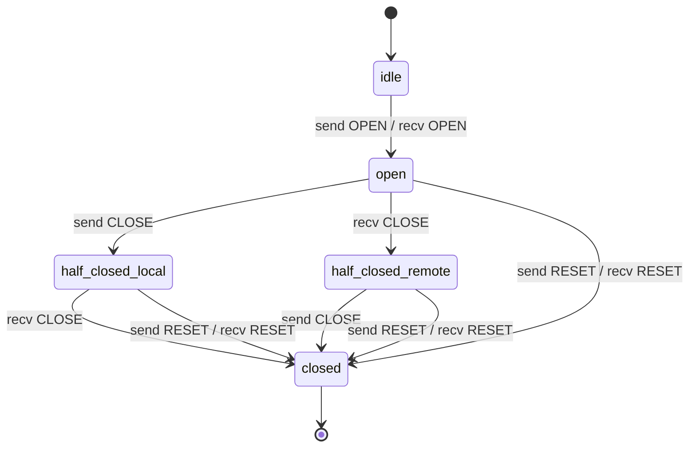

# ws-mixer: flow control and stream lifecycle

Date: 2026-08-25 · Pass 2. Builds on [pass 1: framing and encoding](./2026-08-25-framing-and-encoding.md) (8-byte header, one WS message = one frame, types OPEN/DATA/WINDOW/CLOSE/RESET, stream 0 = control, 64 KiB hard cap / 16 KiB chunk, odd server-opened ids). Control-message *shapes* on stream 0 are pass 3; this pass fixes the *codes* they carry.

## Recommendation up front

| Decision | Value |
|---|---|
| Flow control scope | **Per-stream credit window only. No connection-level window.** |
| Initial window | **262 144 B (256 KiB)**, per-direction, announced by each peer in `hello` as its own *receive* window. Absent → 256 KiB. |
| Window renegotiation | **None.** Fixed for the life of the connection. No mid-connection resize. |
| Credit accounting | Only DATA payload bytes on streams ≥ 1. Headers, OPEN/CLOSE/RESET/WINDOW, and all of stream 0 are **not** flow-controlled. |
| When receiver sends WINDOW | On **consumption** (delivery to the application), once un-credited consumed bytes ≥ `initial_window / 2`. |
| WINDOW payload | Exactly 4 bytes, `uint32` BE increment, legal range `1 .. 2^31-1`. |
| Sender at window 0 | MUST NOT send DATA. MAY still send WINDOW / CLOSE / RESET. Blocks in the application, never on the socket read loop. |
| Window overflow | Send window would exceed `2^31-1`, or DATA exceeds remaining credit → **connection error `FLOW_CONTROL_ERROR`**. |
| RESET payload | `error_code uint32 BE` + optional UTF-8 message (rest of payload, SHOULD ≤ 256 B). |
| Error code space | One 32-bit space shared by RESET and stream-0 connection errors. `0x0000_0000–0x0000_0FFF` reserved for ws-mixer; `≥ 0x1000_0000` free for the layer above. |
| WS close code | **`4000 + error_code`** for connection-fatal codes; `1000` for `NO_ERROR`. Reason string = the human message, truncated to 123 bytes. |
| Max concurrent streams | Announced by the OPEN-*receiver* (the client) in `hello`. Default 100. Exceeded → `RESET(STREAM_LIMIT)`, repeat offence → connection `ENHANCE_YOUR_CALM`. |
| Per-stream buffer cap | Exactly the advertised window. No second knob. Connection memory bound = `max_concurrent_streams × initial_window`. |
| Idle timeouts | **None at the stream level.** Connection keepalive only (already mandated by Cloudflare's 100 s idle cut). |
| Stream states | `idle → open → half-closed(local\|remote) → closed`. No reserved/push states, no SYN/ACK handshake. |

Two negotiated numbers (`initial_window`, `max_concurrent_streams`), one threshold rule, one error table. That is the entire flow-control surface.

---

## 1. Flow control

### 1.1 Per-stream only — and why not a connection window

| | HTTP/2 | yamux | muxado | **ws-mixer** |
|---|---|---|---|---|
| Per-stream window | 65 535 initial, `SETTINGS_INITIAL_WINDOW_SIZE` | 256 KiB (`initialStreamWindow`) | `MaxWindowSize` per stream | **256 KiB, hello-negotiated** |
| Connection window | **yes**, 65 535 initial, WINDOW_UPDATE only | **no** ("There is no window size for the session") | no | **no** |
| Window resize mid-connection | yes, with retroactive adjustment (§6.9.2) | no (max set at construction) | no | **no** |

Sources: [RFC 9113 §6.9.2](https://www.rfc-editor.org/rfc/rfc9113.html#section-6.9.2), [yamux spec.md § Flow Control](https://github.com/hashicorp/yamux/blob/master/spec.md), [yamux const.go `initialStreamWindow = 256 * 1024`](https://github.com/hashicorp/yamux/blob/master/const.go).

HTTP/2 needs a connection window because an intermediary muxes thousands of unrelated origins over one socket and must bound total buffering independently of stream count. We get the same bound for free from `max_concurrent_streams × initial_window`, with one fewer moving part — and the h2 connection window is a well-known stall source (the 65 535 default throttles a whole connection to one BDP regardless of how many streams are running). yamux ships per-stream-only and is production-proven in Consul/Nomad/frp.

**The honest counter-argument**: with per-stream only, memory scales linearly with stream count, so `max_concurrent_streams` becomes a hard memory knob rather than a soft concurrency knob. At 100 × 256 KiB that is 25 MiB worst case per tunnel — fine for hundreds of tunnels, not for 100 k. The lever is that **windows are per-direction and need not match**: the mcpwarp server carries *requests* outbound (small) and receives *responses* inbound (large), so the server sizes its own advertised receive window to its memory budget (128 KiB × 64 streams = 8 MiB/tunnel is a sane server-side policy) while the client can advertise 64 KiB and still interoperate. Revisit a connection window only if `max_concurrent_streams` ever goes into the thousands.

**Why 256 KiB and not 65 535**: a single MCP response is usually kilobytes and an SSE stream is a trickle, so the window rarely binds. But when it does — a large tool result — 64 KiB at a 100 ms Cloudflare RTT caps one stream at ~640 KB/s. 256 KiB costs nothing in the common case and removes the stall. Matching yamux's number also means "it's the yamux default" is a sufficient answer to "why this number".

### 1.2 The update rule

```
receiver state per stream:  recv_window  (credit still owed to peer)
                            unacked      (bytes delivered to app, not yet credited)

on DATA(n):    if n > recv_window: CONNECTION ERROR FLOW_CONTROL_ERROR
               recv_window -= n ; buffer n

on app reads n: unacked += n
                if unacked >= initial_window / 2:
                    send WINDOW(unacked); recv_window += unacked; unacked = 0
```

- **Credit on consumption, never on receipt.** Crediting on receipt turns the window into an unbounded buffer and deletes the entire point. muxado credits inside `Read` ([stream.go](https://github.com/inconshreveable/muxado/blob/master/stream.go)); yamux computes `delta := (max - bufLen) - recvWindow` and only emits when `delta >= max/2` ([stream.go `sendWindowUpdate`](https://github.com/hashicorp/yamux/blob/master/stream.go)) — same effect, expressed via the buffer length.
- **Half-window threshold** is yamux's and (commented-out) muxado's. It bounds WINDOW frames to ~2 per window of data — negligible overhead — while never letting the sender's credit drop below half. Do not send tiny increments (RFC 9113 §6.9.1 cites the silly-window-syndrome advice of RFC 1122 §4.2.3.3).
- **Increment 0 is illegal**: RFC 9113 §6.9 makes it a stream error `PROTOCOL_ERROR`. Same here.
- **WINDOW on stream 0 is illegal in v1** (there is no connection window) → connection `PROTOCOL_ERROR`.
- **WINDOW payload length ≠ 4** → connection `FRAME_SIZE_ERROR` (RFC 9113 §6.9 does the same).
- **WINDOW must be tolerated late.** A peer may send WINDOW just before it receives our CLOSE/RESET. Receiving WINDOW on a half-closed or recently-closed stream MUST NOT be an error (RFC 9113 §6.9, §5.1 both say this explicitly). This is the one race the ordered transport does not remove.

### 1.3 Sender behaviour, overflow, negotiation

- Window 0 → the stream's writer blocks in the application. It MUST NOT block the WS read loop, and MUST NOT block other streams' writes.
- A sender MUST NOT let its send window exceed `2^31-1`. If an incoming WINDOW would push it over: **connection `FLOW_CONTROL_ERROR`**. (HTTP/2 allows stream-level here; we escalate because a peer that overflows a 2 GiB counter has broken accounting, not a bad stream.)
- Receiving DATA larger than the remaining credit is likewise a **connection** error. yamux does exactly this — `ErrRecvWindowExceeded` → `GoAway(protoErr)` → session dies ([session.go `handleStreamMessage`](https://github.com/hashicorp/yamux/blob/master/session.go)). The receiver has already had to read the bytes off the wire; a stream-level reset would leave the two credit counters permanently out of sync.
- **Negotiation**: each peer states `initial_window` in `hello`, describing *what it will accept*. Fixed thereafter. This sidesteps RFC 9113 §6.9.2's retroactive-adjustment rule — the one that lets a flow-control window go **negative** and is, empirically, where h2 implementations get it wrong. Since `hello` precedes any OPEN, there is never ambiguity about which window a new stream starts with.

### 1.4 Interaction with WebSocket / TCP backpressure

Two independent layers. Conflating them is the main way this design fails in practice.

| Layer | Bounds | Granularity | Failure if ignored |
|---|---|---|---|
| Credit window | per-stream application buffering | one stream | one stream stalls (correct) |
| WS/TCP socket buffers | total bytes in flight | whole connection | **head-of-line stall of every stream** |

**Rule 1 — the receive loop must never block on application delivery.** Read message → parse 8-byte header → append payload to that stream's buffer (guaranteed to fit: credit says so) → loop. If the loop instead awaits the application, one slow handler stalls the tunnel. Python `websockets` will *help* you do the wrong thing: `max_queue=16` pauses `transport.pause_reading()` when 16 messages back up ([memory topic](https://websockets.readthedocs.io/en/stable/topics/memory.html), [`asyncio/connection.py`](https://github.com/python-websockets/websockets/blob/main/src/websockets/asyncio/connection.py) — `max_queue: int = 16`, `write_limit: int = 2**15`). That pause is TCP-level and blocks *all* streams. Credit windows exist so you never need it.

**Rule 2 — gate the write loop on the socket send buffer.** Credit bounds per-stream *unacked* bytes; with 100 streams × 256 KiB you can still queue 25 MB into the WS library before a single byte is acknowledged.

| Runtime | Mechanism | What the SDK must do |
|---|---|---|
| Node [`ws`](https://github.com/websockets/ws/blob/master/doc/ws.md) | `ws.send()` queues without bound; `bufferedAmount` = "bytes queued using calls to `send()` but not yet transmitted"; `send(data, cb)` fires when written out | pause the writer while `bufferedAmount > 1 MiB`; resume on the `send` callback |
| Browser `WebSocket` | `bufferedAmount` only, no callback | same, polled |
| Python `websockets` | `await ws.send()` returns only once the write buffer drains under the low-water mark (`write_limit` high-water = 32 KiB) | nothing — `await` gives it to you |
| Go [coder/websocket](https://github.com/coder/websocket/blob/master/write.go) | `Write`/`Writer` are synchronous and context-bounded; one writer at a time; no internal send queue | nothing — the write blocks |

**Rule 3 — control frames jump the queue.** A WINDOW frame stuck behind a megabyte of queued DATA is a throughput deadlock. Single writer task, two queues:

```
loop:
  drain control queue first  (WINDOW, CLOSE, RESET, stream-0 JSON)
  then one DATA chunk (≤ 16 KiB) from the next stream in round-robin order
  if socket send buffer is above high-water: await drain
```

Round-robin at the 16 KiB chunk boundary is what makes 100 concurrent MCP requests share the tunnel fairly. Without it, one large tool result starves every SSE stream behind it. No priorities, no weights — HTTP/2 deprecated its priority scheme in RFC 9113 for good reason.

---

## 2. Stream state machine

Only the server opens streams (pass 1). States are per-endpoint and subjective — "local" always means "this endpoint".



```
                    +--------+
                    |  idle  |
                    +---+----+
          send OPEN /   |   \ recv OPEN
                    +---v----+
                    |  open  |
       send CLOSE  /          \  recv CLOSE
     +------------v-+        +-v------------+
     | half-closed  |        | half-closed  |
     |   (local)    |        |   (remote)   |
     +------+-------+        +-------+------+
            | recv CLOSE             | send CLOSE
            |    send/recv RESET     |
            +--------->+-------------+
                       | closed |
                       +--------+
```

### 2.1 Legal frames per state

Sending (`—` = MUST NOT send):

| State | OPEN | DATA | WINDOW | CLOSE | RESET |
|---|---|---|---|---|---|
| idle | ✔ (opener only) | — | — | — | — |
| open | — | ✔ | ✔ | ✔ | ✔ |
| half-closed (local) | — | — | ✔ | — | ✔ |
| half-closed (remote) | — | ✔ | — ¹ | ✔ | ✔ |
| closed | — | — | — | — | — ² |

¹ pointless (peer will send no more DATA), but a WINDOW already in flight is legal — see receive table.
² MUST NOT send RESET in response to RESET (RFC 9113 §5.4.2 — loop prevention).

Receiving:

| State | recv OPEN | recv DATA | recv WINDOW | recv CLOSE | recv RESET |
|---|---|---|---|---|---|
| idle (`id > highest_opened`) | → open | **conn PROTOCOL_ERROR** | **conn PROTOCOL_ERROR** | **conn PROTOCOL_ERROR** | **conn PROTOCOL_ERROR** |
| open | **conn PROTOCOL_ERROR** (dup) | buffer, debit credit | credit sender | → half-closed(remote) | → closed, drop buffer |
| half-closed (local) | conn PROTOCOL_ERROR | buffer, debit credit | **tolerate, ignore** | → closed | → closed, drop buffer |
| half-closed (remote) | conn PROTOCOL_ERROR | **RESET(STREAM_CLOSED)** | **tolerate, ignore** | **RESET(STREAM_CLOSED)** | → closed |
| closed / `id ≤ highest_opened`, no live stream | conn PROTOCOL_ERROR | discard + count | discard + count | discard + count | discard + count |

### 2.2 Unknown / stale stream ids

Because ids are strictly increasing and server-opened, one counter (`highest_opened`) separates the two cases cleanly:

- **`id > highest_opened` and the frame is not OPEN** → the peer invented an id. Deterministic bug, no race can produce it. **Connection `PROTOCOL_ERROR`.** (HTTP/2 §5.1 "idle": same verdict.)
- **`id ≤ highest_opened` with no live stream** → the stream was closed or reset and the peer's frames were already in flight. **Discard, increment a counter, log at debug.** Not silent — observable — but not fatal.

This is deliberately stricter than yamux, which logs `"frame for missing stream"` at WARN and drops it in *both* cases ([session.go](https://github.com/hashicorp/yamux/blob/master/session.go)) — including for ids that were never opened, so a peer sending pure garbage ids gets nothing but log spam. HTTP/2's rule (§5.1 "closed") is the same shape as ours but hedged with "endpoints SHOULD NOT use timers for this purpose"; our monotonic-id invariant removes the need for timers or a recently-closed set entirely.

Optional stricter variant if SDK bugs prove noisy: keep a FIFO of the last 1024 closed ids; anything below `highest_opened` and *not* in the FIFO becomes a connection error too. Costs 4 KB and one lookup. Recommend deferring — start with discard+count and see whether the counter ever moves.

---

## 3. Half-close semantics

- **OPEN carries no payload in v1.** Keeping OPEN a pure state event means one meaning per frame type. There is no ACK to wait for, so a DATA frame emitted in the same tick costs zero RTT — the only saving would be 8 bytes. (If pass 3 wants request metadata attached to stream creation, that is an argument for an OPEN payload; flagged as an open question.)
- **CLOSE = "I will send no more DATA on this stream."** Direction-scoped, exactly yamux's FIN / HTTP/2's END_STREAM. The peer may keep sending indefinitely. Payload MUST be empty; a receiver MUST ignore trailing bytes (forward-compat, consistent with pass 1's reserved-bytes rule) and count the occurrence.
- **CLOSE preserves buffered data; RESET discards it.** A receiver that has 40 KiB buffered and then reads CLOSE must still deliver those 40 KiB and *then* EOF. On RESET it drops them. This distinction is the most commonly botched part of a muxer — state it in the spec in exactly these words.
- **Fully closed** = both directions closed (CLOSE sent *and* received), or either side sent/received RESET. At that instant both endpoints free the receive buffer, drop the stream from the table and stop tracking credit. The **id is retired forever** — never reused (pass 1), which is what makes the discard-stale rule safe.

### The request/response case, end to end

| Step | Server (opener) | Client | Server state | Client state |
|---|---|---|---|---|
| 1 | `OPEN(id=n)` | | open | open |
| 2 | `DATA` × k (request head + body, 16 KiB chunks) | credits with `WINDOW` as it consumes | open | open |
| 3 | `CLOSE` — request body complete | reads EOF on the request | half-closed(local) | half-closed(remote) |
| 4 | credits with `WINDOW` | `DATA` × m — response, possibly for hours (SSE) | half-closed(local) | half-closed(remote) |
| 5 | | `CLOSE` — response complete | **closed** | **closed** |

Aborts:

| Event | Frame | Code |
|---|---|---|
| Public HTTP client hung up | server → `RESET` | `CANCEL` |
| Client at its stream limit | client → `RESET` | `STREAM_LIMIT` |
| Client declines before doing any work (unknown service id, shutting down) | client → `RESET` | `REFUSED_STREAM` |
| Local MCP server crashed mid-response | client → `RESET` | `INTERNAL_ERROR` |
| Local MCP server unreachable *before* any response bytes | prefer the HTTP layer: `DATA`(502) + `CLOSE`. `RESET(INTERNAL_ERROR)` is the ws-mixer-level fallback and loses the status code | |

RESET is legal from either side in `open`, `half-closed(local)` and `half-closed(remote)` — including from the side that already sent CLOSE (it aborts the *other* direction and tears down the stream). On an already-closed stream it is discarded and counted.

---

## 4. Error codes

One 32-bit space shared by RESET and connection errors, following RFC 9113 §7 ("Error codes share a common code space"). One enum per SDK.

| Code | Name | Stream | Conn | Server may send | Client may send | Meaning |
|---|---|:--:|:--:|:--:|:--:|---|
| 0x00 | `NO_ERROR` | | ✔ | ✔ | ✔ | graceful shutdown; no error |
| 0x01 | `PROTOCOL_ERROR` | ✔ | ✔ | ✔ | ✔ | violation with no more specific code |
| 0x02 | `INTERNAL_ERROR` | ✔ | ✔ | ✔ | ✔ | unexpected failure on the sender's side |
| 0x03 | `FLOW_CONTROL_ERROR` | | ✔ | ✔ | ✔ | credit exceeded, or window > 2^31-1 |
| 0x04 | `FRAME_SIZE_ERROR` | | ✔ | ✔ | ✔ | frame too large, or fixed-size payload wrong |
| 0x05 | `STREAM_CLOSED` | ✔ | | ✔ | ✔ | DATA/CLOSE after the peer's CLOSE |
| 0x06 | `REFUSED_STREAM` | ✔ | | | ✔ | **not processed at all** — safe to retry elsewhere |
| 0x07 | `CANCEL` | ✔ | | ✔ | ✔ | no longer needed; work may have started |
| 0x08 | `STREAM_LIMIT` | ✔ | | | ✔ | `max_concurrent_streams` exceeded |
| 0x09 | `ENHANCE_YOUR_CALM` | ✔ | ✔ | ✔ | ✔ | peer generating excessive load; back off |
| 0x0a | `UNSUPPORTED` | | ✔ | ✔ | ✔ | version/feature mismatch in `hello`; do not retry unchanged |
| 0x0b | `UNAUTHORIZED` | | ✔ | ✔ | | auth failed or expired; do not retry without new credentials |
| 0x0c | `GOING_AWAY` | | ✔ | ✔ | | drain/rollout; **reconnect immediately, no backoff** |
| 0x0d | `KEEPALIVE_TIMEOUT` | | ✔ | ✔ | ✔ | no keepalive within the deadline |

- `0x0000_0000–0x0000_0FFF` reserved for ws-mixer. `≥ 0x1000_0000` is free for the HTTP layer above, so it can put its own codes in a RESET without colliding.
- **Unknown codes MUST NOT trigger special behaviour**; treat as `INTERNAL_ERROR` (RFC 9113 §7 verbatim).
- The `REFUSED_STREAM` / `CANCEL` split is load-bearing and is exactly HTTP/2's (§8.7): `REFUSED_STREAM` promises nothing was processed, so the layer above may safely replay the request; `CANCEL` promises nothing.

### RESET payload

```
 offset  size  field
 0       4     error_code   uint32 BE
 4       ..    message      UTF-8, optional, SHOULD be ≤ 256 B, no NUL terminator
```

Payload < 4 bytes → connection `FRAME_SIZE_ERROR`. Invalid UTF-8 in the message → replace, do not kill the connection (the message is diagnostics, not protocol). Receivers MUST surface `code` **and** `message` to the application/logs — that is the whole point of carrying a message: an SDK author whose stream got reset sees `FLOW_CONTROL_ERROR: sent 20480 bytes with 8192 credit remaining on stream 41` instead of a bare number.

### Prior art

| | HTTP/2 §7 | yamux | muxado | **ws-mixer** |
|---|---|---|---|---|
| Code width | 32-bit | 32-bit (GoAway only) | 32-bit | 32-bit |
| Codes defined | 14 | **3** (Normal/Protocol/Internal) | 16 | **14** |
| Stream-level codes | yes (RST_STREAM) | **none** — RST is a bare flag, no code | yes | yes |
| Human-readable message on the wire | no | no | no | **yes** |
| App-reserved code range | no | no | no | **yes (≥ 0x1000_0000)** |

yamux is the cautionary tale: a reset stream gives you `ErrConnectionReset` with **no code and no message**, and its own docstring admits the cause could be "the backlog is exceeded, or … a remote GoAway" ([const.go](https://github.com/hashicorp/yamux/blob/master/const.go)). Debugging a third-party SDK against that is guesswork. muxado's 16 codes are the right shape but have no message field either.

---

## 5. Connection-level errors

### 5.1 What kills the connection vs. the stream

| Violation | Verdict | Code |
|---|---|---|
| WS message < 8 bytes (truncated header) | connection | `PROTOCOL_ERROR` |
| WS message > 8 + 65 536 | connection (+ WS 1009) | `FRAME_SIZE_ERROR` |
| Text opcode instead of binary | connection | `PROTOCOL_ERROR` |
| Unknown frame type | **ignore + count** (pass-1 rule) | — |
| `stream_id` high bit set | connection | `PROTOCOL_ERROR` |
| OPEN sent by the client, or even id, or id ≤ `highest_opened` | connection | `PROTOCOL_ERROR` |
| Duplicate OPEN for a live id | connection | `PROTOCOL_ERROR` (yamux: `ErrDuplicateStream` + GoAway) |
| Non-OPEN frame for `id > highest_opened` | connection | `PROTOCOL_ERROR` |
| OPEN / CLOSE / RESET on stream 0 | connection | `PROTOCOL_ERROR` |
| WINDOW on stream 0 | connection | `PROTOCOL_ERROR` |
| WINDOW payload length ≠ 4 | connection | `FRAME_SIZE_ERROR` |
| WINDOW increment 0 | stream | `PROTOCOL_ERROR` |
| WINDOW pushes send window > 2^31-1 | connection | `FLOW_CONTROL_ERROR` |
| DATA exceeds remaining credit | connection | `FLOW_CONTROL_ERROR` |
| Any frame before `hello` completes | connection | `PROTOCOL_ERROR` |
| Malformed JSON on stream 0 | connection | `PROTOCOL_ERROR` |
| Stream-0 payload > 16 KiB, or control flood | connection | `ENHANCE_YOUR_CALM` |
| Keepalive deadline missed | connection | `KEEPALIVE_TIMEOUT` |
| RESET payload < 4 bytes | connection | `FRAME_SIZE_ERROR` |
| DATA or CLOSE after peer's CLOSE | **stream** | `STREAM_CLOSED` |
| OPEN beyond `max_concurrent_streams` | **stream** | `STREAM_LIMIT` |
| Application declines the stream | **stream** | `REFUSED_STREAM` |
| Local handler failed | **stream** | `INTERNAL_ERROR` |
| Cancelled | **stream** | `CANCEL` |

Guiding line: **anything that desynchronises shared connection state (credit accounting, id space, framing) is fatal; anything scoped to one request is a RESET.**

Note that stream 0 is *not* flow-controlled, so it needs its own bound: control payloads MUST be ≤ 16 KiB and a receiver MAY rate-limit control messages, answering abuse with `ENHANCE_YOUR_CALM`.

### 5.2 Reporting a connection error

Three steps, in order, then close. Do not wait more than ~2 s for the peer's close handshake.

1. **In-band on stream 0**: a control message carrying `{code, message, last_stream_id}` — the GOAWAY analogue. `last_stream_id` tells the peer which streams were definitely not processed, so they can be safely retried on a new connection. *Exact shape: pass 3.*
2. **WS Close frame**: code `4000 + error_code`, reason = the human message.
3. **Close the socket.**

Why both: RFC 6455 §5.5 caps control frames at 125 bytes, so the WS close reason is **≤ 123 bytes of UTF-8** — enough for a code name, not enough for a useful diagnostic, and browsers surface it inconsistently. The stream-0 message carries the detail; the close code carries the machine-readable verdict even when the stream-0 message is lost in a race.

### 5.3 WS close codes

RFC 6455 §7.4.2 reserves **4000–4999 for private use**. Mechanical rule, no second table to maintain:

| WS code | ws-mixer code | Client reconnect policy |
|---|---|---|
| 1000 | `NO_ERROR` | normal backoff |
| 1009 | (WS layer rejected an oversized message before we saw it) | backoff |
| 4001 | `PROTOCOL_ERROR` | backoff + **loud developer-facing error** |
| 4002 | `INTERNAL_ERROR` | backoff |
| 4003 | `FLOW_CONTROL_ERROR` | backoff + loud developer-facing error |
| 4004 | `FRAME_SIZE_ERROR` | backoff + loud developer-facing error |
| 4009 | `ENHANCE_YOUR_CALM` | **long** backoff |
| 4010 | `UNSUPPORTED` | **stop**; surface to the developer |
| 4011 | `UNAUTHORIZED` | **stop**; surface to the user |
| 4012 | `GOING_AWAY` | **reconnect immediately, no backoff** (drain/rollout path from the tunnel-architecture pass) |
| 4013 | `KEEPALIVE_TIMEOUT` | immediate retry, then backoff |

---

## 6. Limits

| Limit | Value | Enforced by | On violation |
|---|---|---|---|
| `max_concurrent_streams` | client-advertised in `hello`, default 100 | client (OPEN-receiver) | `RESET(STREAM_LIMIT)`; repeat → conn `ENHANCE_YOUR_CALM` |
| Streams counted | `open` + both `half-closed` states (RFC 9113 §5.1.2) | | |
| Per-stream receive buffer | = advertised window | receiver | `FLOW_CONTROL_ERROR` (conn) |
| Connection buffer bound | `max_concurrent_streams × initial_window` + one in-flight message | derived, no knob | |
| Stream-0 payload | ≤ 16 KiB | receiver | conn `ENHANCE_YOUR_CALM` |
| Outbound socket buffer | ≥ 1 MiB high-water (Node/browser) | sender | pause writer |

**Slow client (single-threaded Python).** This is the case the design is built around, and it needs no special mechanism:

- The WS read loop only appends to per-stream buffers, so it never blocks and never triggers `websockets`' `max_queue` transport pause.
- A handler that stops reading simply stops emitting WINDOW frames → its credit runs out → the server stops sending on *that stream only*. Every other stream keeps flowing.
- The server sees a stream sitting at window 0 and applies its own policy (metric, and optionally `RESET(ENHANCE_YOUR_CALM)` after some minutes) — that policy is server config, not protocol.
- This is precisely the property mplex lacked. libp2p's own docs: *"mplex does not have any flow control"* and *"mplex also doesn't limit how many streams a peer can open"* — which is why *"mplex is currently in the process of being deprecated"* ([libp2p/docs mplex.md](https://github.com/libp2p/docs/blob/master/content/concepts/multiplex/mplex.md), [libp2p yamux concept page](https://docs.libp2p.io/concepts/multiplex/yamux/)). Both of the things mplex omitted are in our two negotiated numbers.

## 7. Timers

**No stream-level idle timeout in the protocol.** Recommendation, with reasons:

| Timer | yamux | **ws-mixer** | Why |
|---|---|---|---|
| Stream open / accept timeout | `StreamOpenTimeout` 75 s (waits for ACK) | **none** | there is no ACK to wait for |
| Half-closed timeout | `StreamCloseTimeout` 5 min, then force-RST | **none** | an SSE response is *legitimately* half-closed for hours; a 5-minute timer would break the primary use case |
| Stream idle timeout | none | **none** | an idle SSE stream is a healthy SSE stream; only the application knows better |
| Connection keepalive | `KeepAliveInterval` 30 s ping | **required, 30–60 s on stream 0** | Cloudflare cuts idle WS at 100 s (pass 1); a dead tunnel resets every stream at once, which is the timeout that actually matters |
| Connection write timeout | `ConnectionWriteTimeout` 10 s safety valve | **recommended, ~30 s** | if the socket won't accept bytes for 30 s the tunnel is dead; kill it rather than growing `bufferedAmount` |

Applications that want per-request deadlines implement them above ws-mixer and express them as `RESET(CANCEL)`. Servers that want to reap zombie streams do it as local policy, not as a spec-mandated timer.

## 8. What the Python dev must implement

Per connection:

1. **Read loop**: for each WS binary message — unpack `>BBHI`, dispatch on type, never await application code. On DATA: check `len ≤ recv_window[id]` (else connection error), append to the stream buffer, `recv_window[id] -= len`.
2. **Write task**: one `asyncio.Task`. Drain a control `deque` first, then round-robin one ≤16 KiB DATA chunk per ready stream. `await ws.send(...)` gives backpressure for free.
3. **Per stream**: `recv_window`, `send_window`, `unacked`, `state`, a `bytearray` buffer, an `asyncio.Event` for readers and one for writers.
4. **On app read of n bytes**: `unacked += n`; if `unacked >= initial_window // 2`, queue `WINDOW(unacked)`, `recv_window += unacked`, `unacked = 0`.
5. **On app write**: wait until `send_window > 0`, send `min(len, send_window, 16384)`, decrement.
6. **State table** (§2.1): 5 states × 5 frame types. Any cell marked conn-error → send the stream-0 error message, close WS with `4000 + code`, done.
7. **`highest_opened`** counter, and a `frames_for_dead_stream` counter.
8. **Keepalive**: a 30 s task sending a stream-0 ping; a watchdog that fails the connection after 2 missed.

That is roughly 250–350 lines with the state table written out longhand. If any SDK's implementation is materially longer, something in this spec is over-designed.

## Open questions for Anatoly

1. **Initial window 256 KiB (yamux's number) or 64 KiB?** 256 KiB × 100 streams = 25 MiB worst case per tunnel. At 10 k concurrent tunnels that is a theoretical 250 GiB — never realised in practice, but what is the server's actual memory budget per tunnel? That number should pick the server's advertised window, and I'd like it before freezing the default.
2. **Connection-level window: really not?** I say no (yamux ships without one). The cost of being wrong is a v2-ish addition — though it *is* addable non-breakingly as a negotiated feature, since WINDOW on stream 0 is currently an error we could later define.
3. **`max_concurrent_streams` default 100** — is that comfortably above the peak in-flight MCP request count you expect per agent, or should it be 1000?
4. **Should OPEN carry the first payload?** Saves 8 bytes and one message per stream; costs the "one frame type, one meaning" property. Depends on whether pass 3 wants request metadata attached to stream creation.
5. **Window overflow / credit violation: connection-fatal, as recommended?** It is the strictest reasonable reading and matches yamux, but it means one accounting bug in a third-party SDK drops every concurrent request on that tunnel. The gentler option is `RESET(FLOW_CONTROL_ERROR)` + permanently blacklisting that stream id.
6. **Stale-frame handling: discard+count, or the 1024-entry closed-id FIFO?** Discard+count is simpler and I recommend starting there, but it is the one place where "silent drop" survives in this design.
7. **Reserved application code range at `≥ 0x1000_0000`** — worth having, or does the HTTP layer above always express failures as HTTP status codes in DATA rather than as RESET codes?
8. **Connection write timeout of 30 s** — needs to be longer than the worst-case Cloudflare stall you have observed. Do we have data?

## Sources

- [RFC 9113 §5.1 stream states](https://www.rfc-editor.org/rfc/rfc9113.html#section-5.1) · [§5.1.2 concurrency](https://www.rfc-editor.org/rfc/rfc9113.html#section-5.1.2) · [§5.4 error handling](https://www.rfc-editor.org/rfc/rfc9113.html#section-5.4) · [§6.9 WINDOW_UPDATE](https://www.rfc-editor.org/rfc/rfc9113.html#section-6.9) · [§7 error codes](https://www.rfc-editor.org/rfc/rfc9113.html#section-7) · [§8.7 retry](https://www.rfc-editor.org/rfc/rfc9113.html#section-8.7)
- [RFC 6455 §5.5 control frame size](https://www.rfc-editor.org/rfc/rfc6455#section-5.5) · [§7.4 close codes](https://www.rfc-editor.org/rfc/rfc6455#section-7.4)
- [hashicorp/yamux spec.md](https://github.com/hashicorp/yamux/blob/master/spec.md) · [stream.go](https://github.com/hashicorp/yamux/blob/master/stream.go) · [session.go](https://github.com/hashicorp/yamux/blob/master/session.go) · [const.go](https://github.com/hashicorp/yamux/blob/master/const.go) · [mux.go (DefaultConfig)](https://github.com/hashicorp/yamux/blob/master/mux.go)
- [inconshreveable/muxado stream.go](https://github.com/inconshreveable/muxado/blob/master/stream.go) · [errors.go](https://github.com/inconshreveable/muxado/blob/master/errors.go) · [session.go](https://github.com/inconshreveable/muxado/blob/master/session.go)
- [libp2p docs: mplex limitations](https://github.com/libp2p/docs/blob/master/content/concepts/multiplex/mplex.md) · [libp2p docs: yamux](https://docs.libp2p.io/concepts/multiplex/yamux/)
- [python-websockets: memory & backpressure](https://websockets.readthedocs.io/en/stable/topics/memory.html) · [asyncio/connection.py defaults](https://github.com/python-websockets/websockets/blob/main/src/websockets/asyncio/connection.py)
- [ws: bufferedAmount / send callback](https://github.com/websockets/ws/blob/master/doc/ws.md) · [coder/websocket write.go](https://github.com/coder/websocket/blob/master/write.go)
